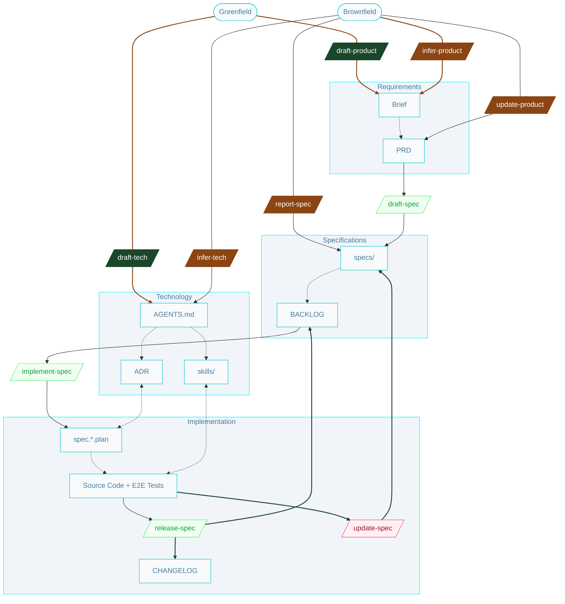

# Full SSD workflow

## Commands

### From Greenfield
- `/draft-product` - Create initial product requirements (Brief + PRD) for a new project.
- `/draft-tech` - Create initial technology documentation (AGENTS.md, ADR, skills/) for a new project.

### From Brownfield
- `/infer-product` - Derive product requirements from an existing codebase.
- `/infer-tech` - Derive technology documentation from an existing codebase.
- `/update-product` - Update product requirements based on new or changed business needs.

### Spec-driven
- `/draft-spec` - Create a new specification from a requirement (defines problem, solution, and verification).
- `/report-spec` - Create a new specification to address a defect reported by QA or end users.
- `/implement-spec` - Run the implementation cycle for one specification: generate plans, produce code, and validate with tests.
- `/release-spec` - Mark a specification as completed, updating its status in the backlog and recording it in the changelog.
- `/update-spec` - Refine an existing specification based on implementation issues and requeue it for implementation.

## Artifacts

### Product
- `Brief` - A high-level description of the product, its purpose, and its target audience.
- `PRD` - Product Requirements Document, defining the product features and requirements.

### Specifications
- `specs/` - The source of truth for system behavior; a directory of detailed specifications (problem, solution, verification), one per feature or bug.
- `BACKLOG` - A structured list of specifications with their status, priority, and dependencies, used for planning and tracking implementation.

### Technology
- `AGENTS.md` - The entry point for any agent joining the project; defines how agents should operate, including rules, workflows, and artifact conventions.
- `skills/` - A directory of reusable capabilities and guidelines for implementing specific technologies.
- `ADR` - Architecture Decision Records, documenting key technical decisions that influence implementation.

### Implementation
- `spec.*.plan` - A set of implementation plans derived from a single specification, defining ordered steps and tasks.
- `Source Code + E2E Tests` - The implementation of the system, including end-to-end tests that validate specifications.
- `CHANGELOG` - A record of completed specifications, documenting what has been implemented and released.